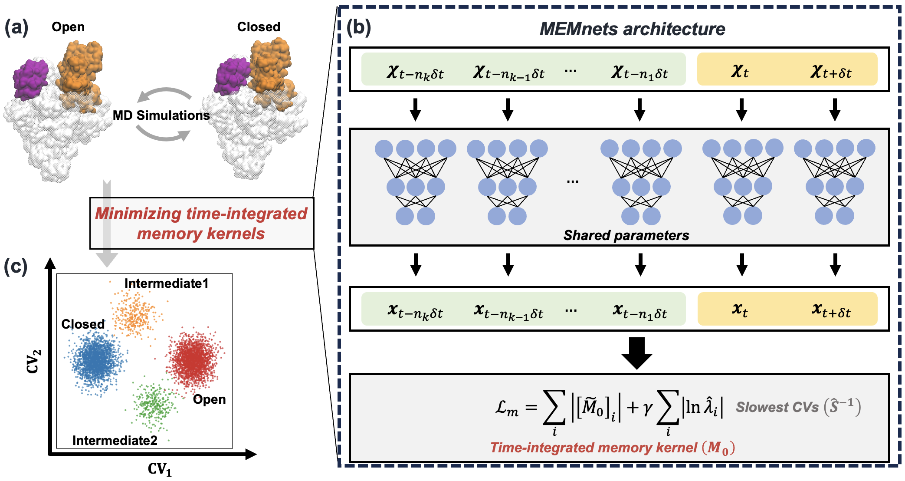

# MEMnets: Memory kernel minimization-based neural networks

### Abstract

Identifying collective variables (CVs) that accurately capture the slowest timescales of protein conformational changes is crucial to comprehend numerous biological processes. In this work, we develop a novel algorithm, the Memory kErnel Minimization based Neural Networks (MEMnets), that accurately identifies the slow CVs of biomolecular dynamics. MEMnets is distinct from popular deep-learning approaches (such as VAMPnets/SRVs) that assume Markovian dynamics. Instead, MEMnets is built on the integrative generalized master equation (IGME) theory, which incorporates non-Markovian dynamics by encoding them in a memory kernel for continuous CVs. The key innovation of MEMnets is to identify optimal CVs by minimizing time-integrated memory kernels. To accomplish this, MEMnets process time sequences of molecular dynamics (MD) conformations by using parallel encoder neural networks that project high-dimensional MD data into a low-dimensional latent space. The time-integrated memory kernels, derived from IGME theory, are then computed in the latent space as the objective function. We demonstrate that our MEMnets algorithm can effectively identify the slow CVs involved in the folding of FIP35 WW-domain with high accuracy, and successful reveal two parallel folding pathways. Furthermore, we test MEMnets’ on the clamp opening of a bacterial RNA polymerase (RNAP), a much more complex conformational change (a system containing over 540K atoms), where sampling from all-atom MD simulations is limited. Our results demonstrate that MEMnets greatly outperforms SRVs, which is based on Markovian dynamics and may result in disconnected dynamics along the identified CVs. We anticipate that MEMnets holds promise to be widely to study biomolecular conformational changes.

### Illustration



## System requires

The software package can be installed and runned on Linux, Windows, and MacOS 

Dependency of Python and Python packages: 

(versions that has been previously tested on are also listed below, other versions should work the same)

```bash
python == 3.9
numpy == 1.26.1
scipy == 1.11.4
torch == 1.13.1
tqdm == 4.66.1
```
The required python packages with the latest versions will be automatically installed if these python packages are not already present in your local Python environment.

## Installation from sources

The source code can be installed with a local clone:

The most time-consuming step is the installation of PyTorch (especially cuda version) and the whole installation procedure takes around 5 mins to complete at a local desktop.

```bash
git clone https://github.com/xuhuihuang/memnets.git
```

```bash
python -m pip install ./memnets
```

## Quick start

### Start with Colab
[](https://colab.research.google.com/github/xuhuihuang/memnets/blob/main/example/alanine_dipeptide_colab.ipynb)

### Start with jupyter notebook

Check this file for the demo:

```
./memnets/example/alanine_dipeptide.ipynb
```

### Start with python script (Linux)

The whole training procedure of the following demo on i9-10900k cpu takes around 30mins to complete at a local desktop.

```sh
python ./memnets/scripts/train_memnets.py \
    --seed 1 \
    --device 'cpu' \
    --lagtimes 1 7 8 9 10 \
    --encoder_sizes 30 30 30 30 10 3 \
    --decay_rate 0.002 \
    --thres 0.05 \
    --learning_rate 0.001 \
    --n_epochs 100 \
    --train_split 0.9 \
    --train_batch_size 10000 \
    --data_directory ./memnets/data/alanine_dipeptide/cartesian_coordinates \
    --saving_directory .  
```

Or
```
sh ./memnets/scripts/train_memnets.sh
```

## How to cite

MEMnets refers to the preprint [10.26434/chemrxiv-2024-71qrl](https://chemrxiv.org/engage/chemrxiv/article-details/66d7653dcec5d6c1420823b6).

[Go to Top](#Abstract)

